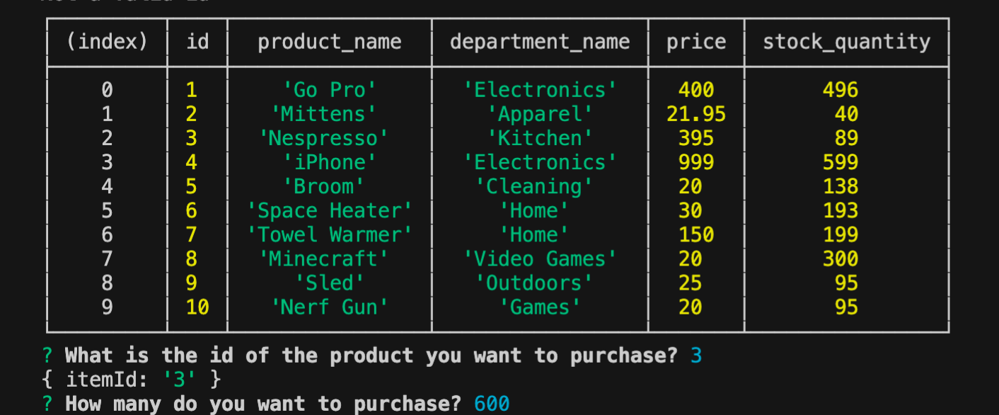
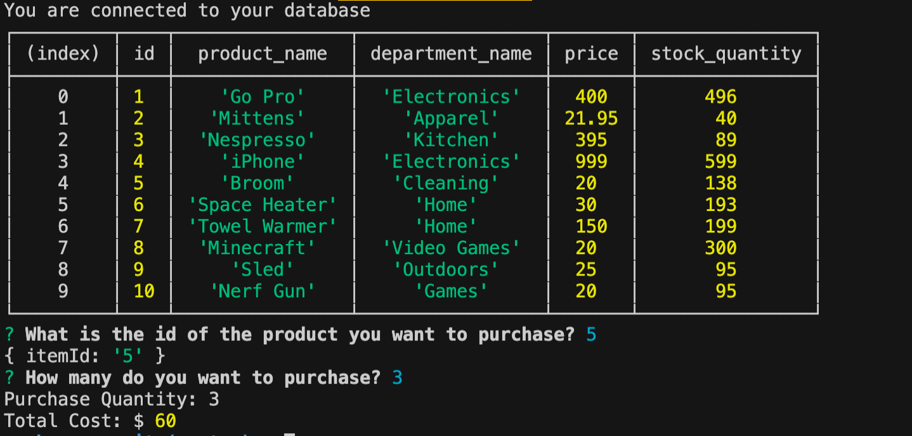
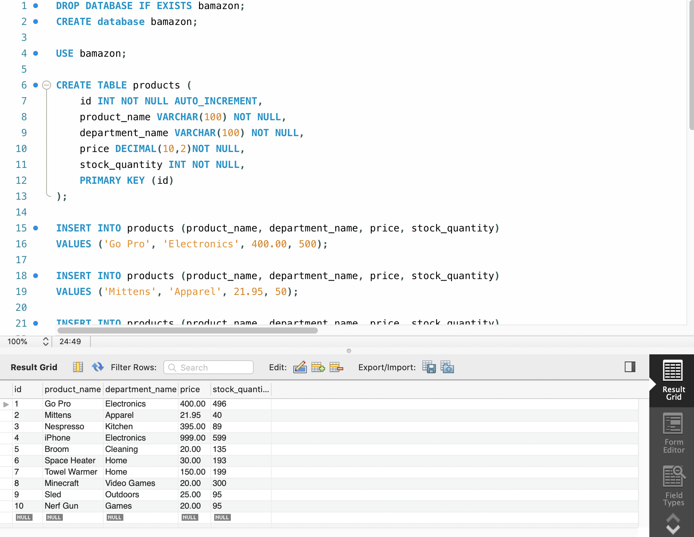

# bamazon

### Link to Screen Recording
[bamazon](https://drive.google.com/file/d/1wVXY_aktJ-noU85tMM4Xxh9ZjJh82tTm/view)

### What is bamazon
Bamazon is an Amazon-like storefront. The app takes orders from the user and depletes stock from the stores inventory. The inventory is stored in a MySQL database. 

## Technolgies Used:
* MySQL
* JavaScript
* Node.js
* Inquirer

### Bamazon Overview

1. The user is first promted for the ID of the product they would like to purchase. 

* If the product is one that is listed on the product table, the user is prompted for a quantity. Otherwise the user is alerted that they have entered and invalid ID and the product table is loaded again. 

2. Next the user is asked for the quantity they would like to purchase. 
* If there is enough of the product in inventory the user is allwed to purchase the items and is shown the total cost. 
* The MySQL database inventory is updated.
* If there is NOT enough of the product in inventory the user is alerted and the app quits and the user can start over. 

### MySQL 

